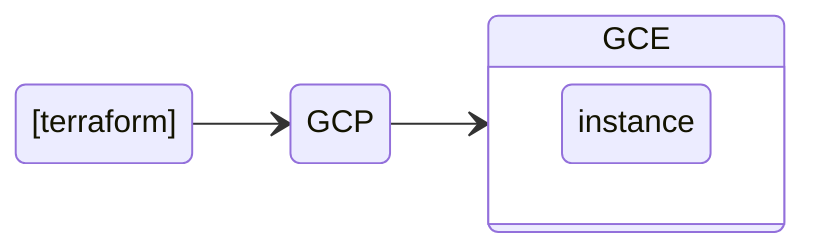

# Google Compute Engine
Esse projeto cria uma instância no Google Cloud Plataform.

## Diagrama



## Passo a passo

1. Instale a ferramenta terraform na sua máquina.


2. Faça o clone desse projeto:
```
    git clone https://github.com/robson-devops/gcp-gce.git  
```

3. Acesse o diretório do projeto e execute o comando de inicialização do Terraform:

```
    cd gcp-gce
    terraform init  
```
4. Faça a validação e formatação do código:
```
    terraform fmt
    terraform validate  
```
5. Aplique o código para a criação do recurso:
```
    terraform apply  
```

6. Se tudo ocorreu corretamente, acesse a console do GCP e verifique a instância recém criada.


7. Destrua o recurso criado:
```
    terraform destroy  
```